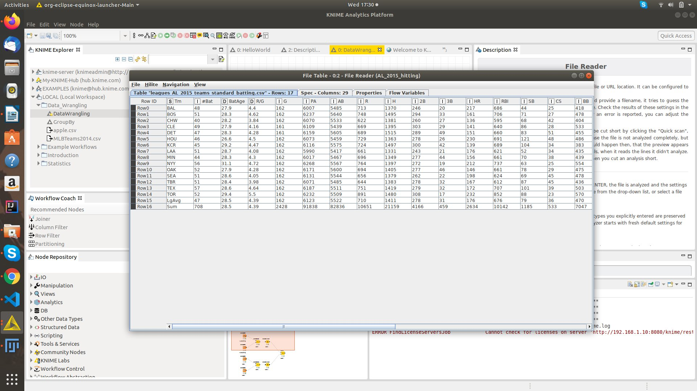
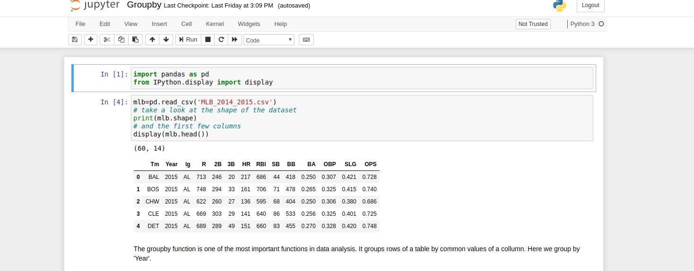

# Assignment 1

Assignment 1 is worth 14 marks.  The main purpose of the assignment is to have you   

1. Install KNIME
2. Access KNIME server, download and transfer examples to your local workspace.
3. Install Annaconda.
4. Join Github, Install GitHub Desktop. Get the ipython notebook examples from github and run them on your local machine. 
5. Run 'opencsv' examples in KNIME and IPython. 
6. Find a new CSV file online.
7. Create a simple workflow that opens the new csv file in KNIME. 
8. Create a simple IPython notebook that opens the new csv file. 

[This Video](https://www.youtube.com/watch?v=9miEihigfGQ) may be helpful.  

## Submit

A word file containing the following. 

1.  The name of your github account.
2.  The name of the .csv file you found online, a link to where you found it, any instructions needed to download it, and a description of what the file contains and why it is interesting to you.  
3.  A screen shot of the KNIME workflow in part 7, showing the open data.  (Hint you need to show the 'file reader'->'file table')
4.  A screen shot of the IPython (aka Jupyter) notebook from part 8. 

## Example Submission

As an example here is what I would submit if doing the assignment.

1.  My github name is bnorthan
2.  I found my data here [on baseball reference](https://www.baseball-reference.com/leagues/AL/2016.shtml).  To get the data you need to scroll down to the 'Team Standard Batting' table, click on 'share and more' and then 'get table as .csv'. 
3.  Below is a screen shot of my data open in KNIME 

  

4.  Below is a screen shot of my data open in IPython notebook.  

  

