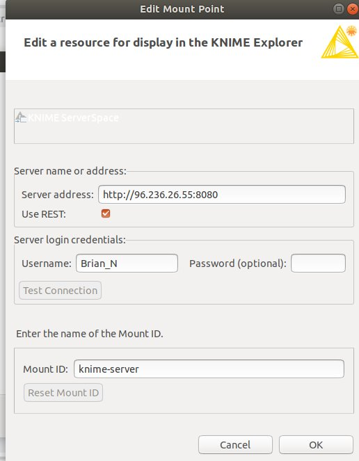
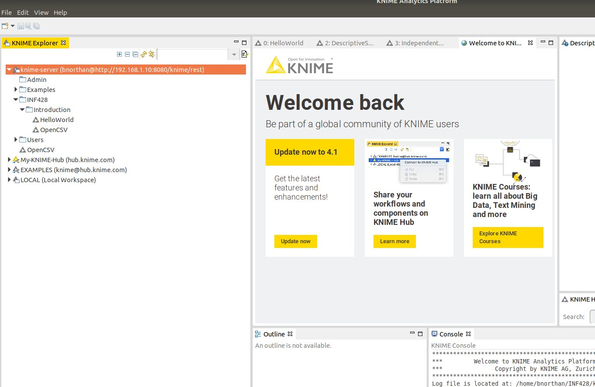

## KNIME
KNIME is a GUI based data analsyis platform.  It allows us to create visual workflows made of units called nodes.

* [KNIME website](https://www.knime.com/)
### Install KNIME

[Download from here](https://www.knime.com/downloads)  

After installing KNIME take a look at the documention.  

KNIME beginner's luck chapter 1.  
   and/or  
Read KNIME Getting Started [here](https://www.knime.com/knime)  
and/or  
Read KNIME Quick Start (a more detailed guide) [here](https://docs.knime.com/2019-06/analytics_platform_quickstart_guide/index.html)  

## KNIME Server 

After downloading and installing KNIME the first thing you need to access the class KNIME Server.   

Please [watch this video](https://www.youtube.com/watch?v=dPoWbC-mODM).  

Follow the instructions in the video, when you get to the 'Edit Mount Point' dialog, make sure the Server Address and 'MountID' are as in the below screen shot.  The username should be your unique username

Server address: http://96.236.26.55:8080
Username: -your user name- (see announcement on blackboard)  
Password: inf428  

  

The information you will need is  
I will create your account and send you an individual username and password. 

After you connect to the KNIME Server you should see it appear in the "KNIME Explorer" as below  

  

### Run KNIME 'Hello World' 

1. Read above materials
2. Connect to KNIME Server
3. Open the INF428 Workflow group Examples
4. Run Hello World example
5. On the 'Hello World' creator node open the 'Manually created table'.
6. Take a screen shot of the result, embed into a word document and submit as part of assignment 1 on Blackboard.  

The following Video may be helpful 

If you have any issues, please post on our discussion group. 

