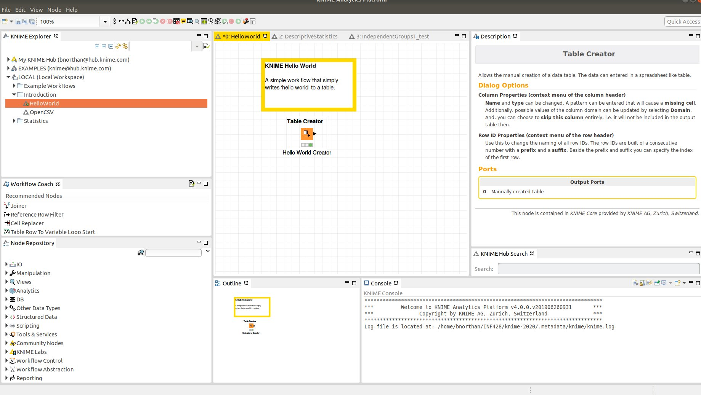

# KNIME Introduction

(Optionally) Read [KNIME Analytics Platform Overview](https://www.knime.com/knime-introductory-course/chapter1)  

Or...  

If you learn by tinkering open up KNIME and try to create a simple workflow.  

Make sure you understand the purpose of all the sub-panels of the KNIME application.  The subpanels are:  

1.  KNIME Explorer - Shows the workflows in your workspace
2.  Workflow Coach - recommends a node for your next step
3.  Node Repository - Select and search for nodes  
4.  Middle panel - Contains the current workflow
5. Description - Gives information and help for the selected node. 
6.  Console - Shows important messages including warning and errors. 

  