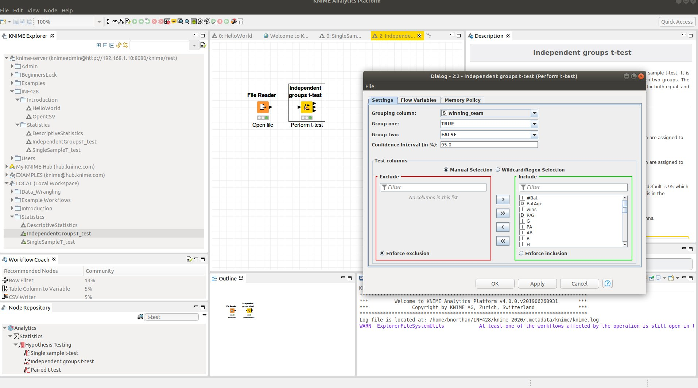

# Hypothesis Testing In Practice

## Single Sample t-test in KNIME  
See example Statistics->SingleSampleT_test on the KNIME Server  

1. Search for t-test in the node repository  
2. Configure t-test with "test value" and choose the column to test   

  

## Independent Groups t-test in KNIME
See example Statistics->IndenpendentGroupsT_test on the KNIME Server

1. Search for t-test in the node repository  
2. Configure t-test with Grouping Column and names of group 1 and group 2
3. note you may have to open the data in a spread sheet and re-organize data so that it has a 'label' column.  A label collumn contains the label for the groups.  For example if the groups are dog and cat and the name of the group is type the table may look as follows

| Name | Weight | Type |
|------|--------|-------|
|Fluffy| 33|Dog
|Claws|15|Cat
|Smokie|45|Dog
|Mr. Big|9|Cat

  

## Single Sample t-test in Python 

See [this example](https://github.com/bnorthan/inf-428-data-analytics-online/blob/master/python/notebooks/statistics/HumanBodyTemp.ipynb)

The test can be run, by first importing data using the Pandas library, then passing the data and the value to be tested to the scipy independent t-test function 

``` python
import scipy.stats
import pandas as pd

temps=pd.read_csv("temps.csv")
scipy.stats.ttest_1samp(temps, 98.6)

```

## Independent Groups t-test in Python  
See this example [here](https://github.com/bnorthan/inf-428-data-analytics-online/blob/master/python/notebooks/statistics/Ind.%20T-test%20Simple.ipynb)

([Also look at this detailed example](https://github.com/bnorthan/inf-428-data-analytics-online/blob/master/python/notebooks/statistics/Ind.%20T-Test%20Baseball%20Teams.ipynb)) which shows the data wrangling needed to get the data into the right format.  

Once we have two dataframes representing the two groups the python code is as follows  

``` python
import numpy as np  
import pandas as pd  
losers=pd.read_csv('losers.csv')  
winners=pd.read_csv('winners.csv') 
import scipy.stats as stats
# perform t-test on wins column
stats.ttest_ind(losers.wins,winners.wins) 

```