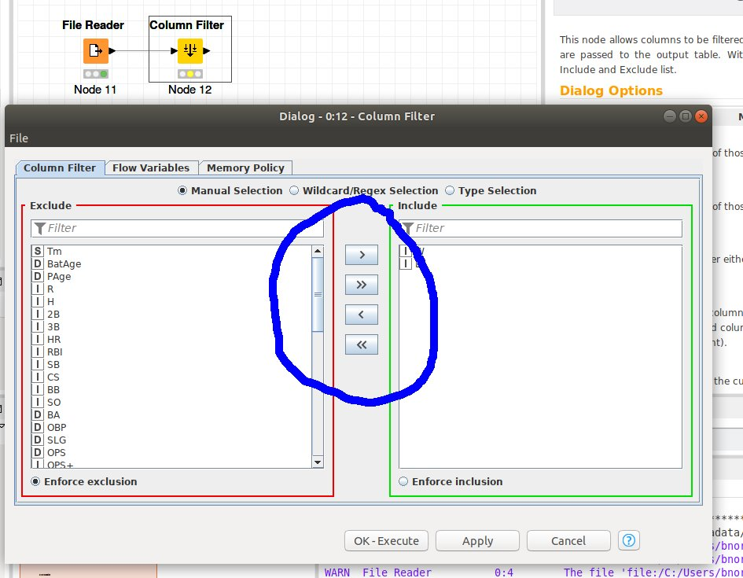

## KNIME

### Column Selection

The column selection GUI is repeated in many nodes, including the column filter, to control which columns operations are applied to.  Study this video closely as the mechanics of column selection are important to many KNIME operations. 

Take a look at the figure below.  The four important buttons are circles in blue.  For a given operation the single forward arrow includes the selected columns, the double forward arrow includes all columns, the back arrow removes selected columns, and the double back arrow removes all columns. 

  

### Column Filter

Column filter is used to remove data columns from your dataset. 

Watch [Video](https://www.knime.com/knime-introductory-course/chapter3/section1/column-filter) which explains the column filter.  

## Row Filter

Row filter is used to remove rows from your dataset.  

Watch [Video](https://www.knime.com/knime-introductory-course/chapter3/section1/basic-row-filter)