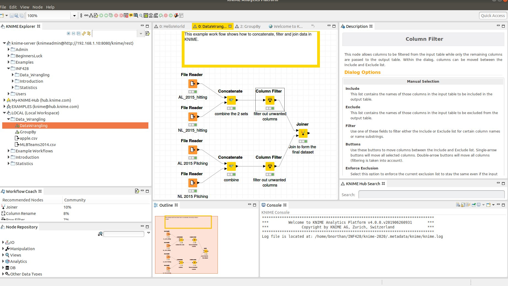

## KNIME

To learn about data wrangling in KNIME read over the class notes and read selected sections from KNIME Beginner's Luck  

2.5 Filter Data Columns
2.6 Filter Data Rows
3.7 Aggregations and Binning
5.3 Transform Rows
5.4 Joining Columns

### Column Selection

The column selection GUI is repeated in many nodes, including the column filter, to control which columns operations are applied to. The mechanics of column selection are important to many KNIME operations. 

Take a look at the figure below.  The four important buttons are circled in blue.  The single forward arrow includes the selected columns, the double forward arrow includes all columns, the back arrow removes selected columns, and the double back arrow removes all columns. 

  

### Column Filter

Column filter is used to remove data columns from your dataset. 

Watch [Video](https://www.knime.com/knime-introductory-course/chapter3/section1/column-filter) which explains the column filter.  

## Row Filter

Row filter is used to remove rows from your dataset.  

Watch [Video](https://www.knime.com/knime-introductory-course/chapter3/section1/basic-row-filter)

## KNIME DataWrangling example

There is a KNIME Data Wrangling example on the KNIME Server under INF428->Data_Wrangling->DataWrangling.  The example shows how to concatenate, filter and join data.  Study the example and use it as a reference for assignment 3. 

Hint -> remember to get the menu of options associated with a node, click on the node. 

## Concatenate in KNIME

Concatenate is used to combine all the rows of 2 datasets (with at least ome common column categories) into one.  For example if you hava a dataset with 20 rows, and another with 30 rows, concatenating the two datasets will result in a new dataset with 50 rows. 

In the 'DataWrangling' example we use Concatenate to combine baseball statistics from the NL and AL into one table.

## Joiner in KNIME

Joiner is used to combine columns of two datasets based on a common row ID.  For example if you have a dataset with 10 columns, and another with 30 columns (excluding the ID column), joining them will result in a new dataset with the same number of rows but 40 columns. 

In the 'DataWrangling' example we use Joiner to combine hitting and pitching statistics for each team.  The resulting dataset has the same number of rows (one row for each team) but contains both the columns for hitting and pitching statistics. 