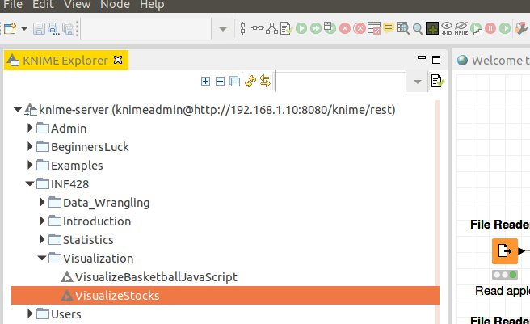
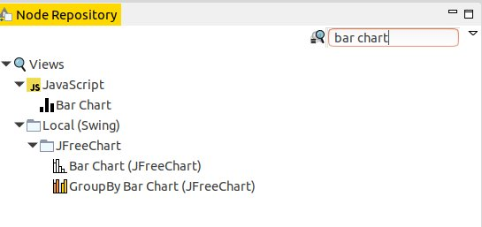
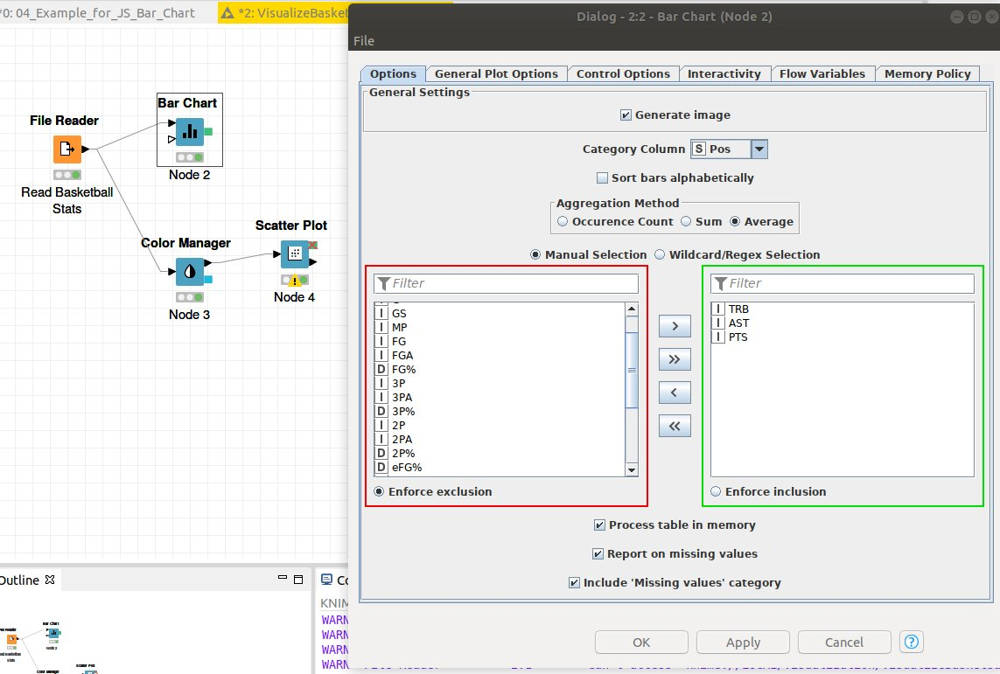
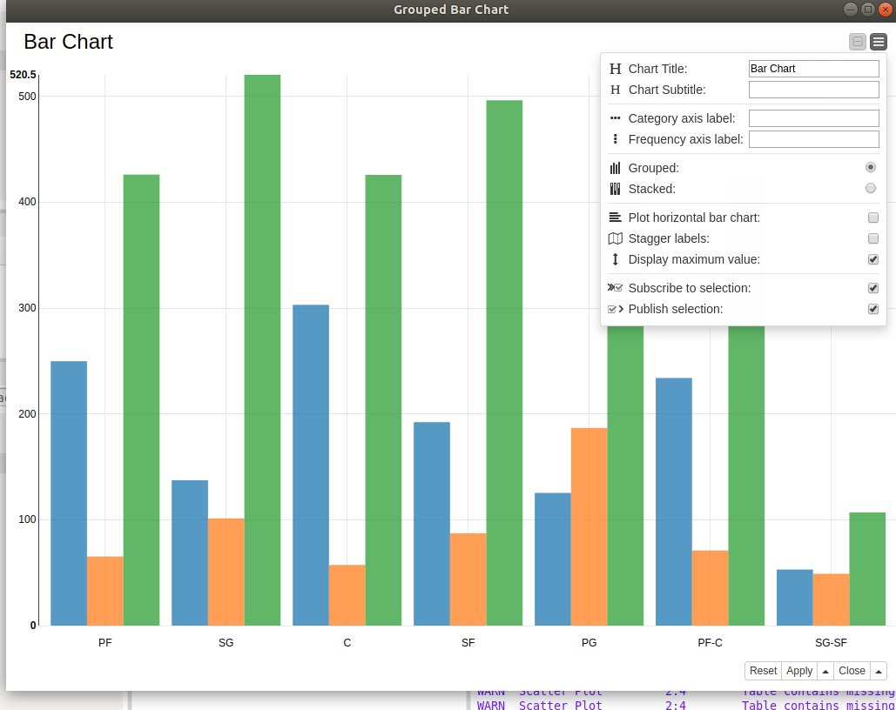
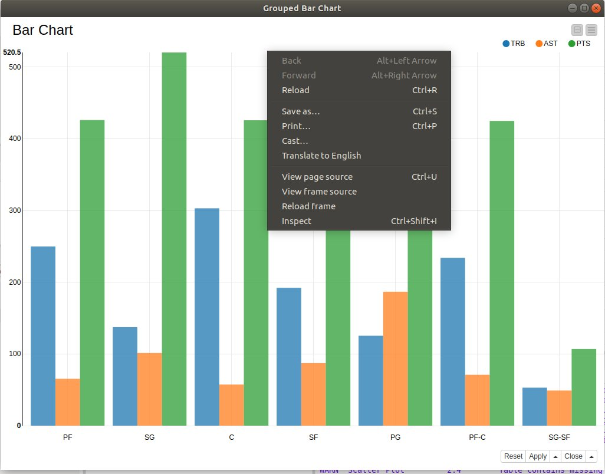
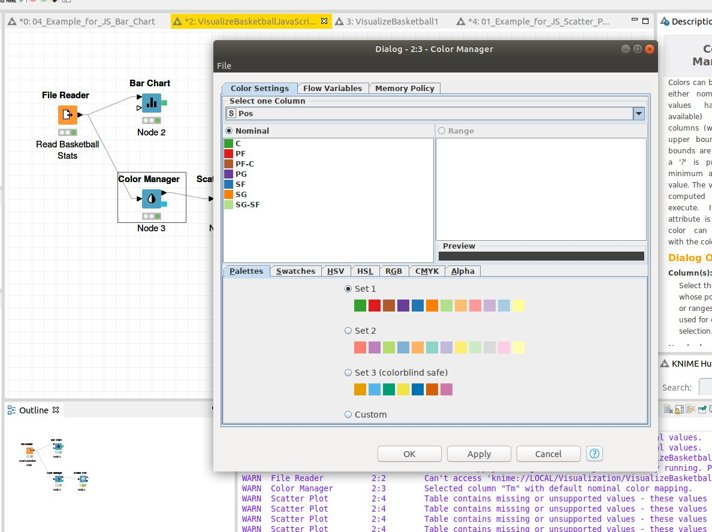
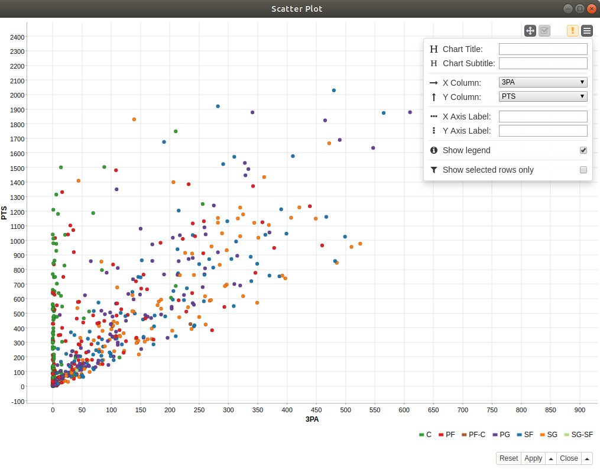

# Web Visualization using KNIME Javascript nodes

JavaScript is a programming language that is one of the core technologies of the internet, along with HTML and CSS.  Using Javascript and the [D3.js](https://d3js.org) library it is possible to create very powerful interactive web visualizations.   

One of the nice features of KNIME is that it allows one to create Javascript visualizations, that can be easilly published to the Web, using a small number of nodes.  A number of nice examples can be found on the [KNIME web site](https://www.knime.com/nodeguide/visualization/javascript)

In this class we will dive deeply into programming with JavaScript.  Of course if you are interested in programming with Javascript it is acceptable to learn a bit about it on your own and do [assignment 4](https://bnorthan.github.io/inf-428-data-analytics-online/Module4/Assignment) with pure Javascript.  

## KNIME Class examples

As mentioned above there are some very good examples [here](https://www.knime.com/nodeguide/visualization/javascript)

There are also examples on the class KNIME Server called VisualizeBasketballJavaScript, and VisualizeStocks.  

 

## Grouped bar chart example

### Choose the Javascript Barchart
In the node repository search for 'bar chart' then choose the Javascript bar chart (not the JFreeChart bar chart)

 

### Configure
Read a file using the File Reader and connect it to the bar chart.  In this case we read a file containing basketball stats.  Then right click on the bar chart node and choose configure.  

1.  Check generate image  
2.  Choose category collumn.  In this case we choose 'Pos' so we can chart different basketball stats per position.  This is equivalent to using the 'groupy' function in Python.  
3.  Choose how to aggregate the groups by choosing the 'Aggregation Method'.  
3.  Then choose which stats to plot.  In this case we choose 'TRB', 'AST', and 'PTS'.  
 

### Interactive View  

Right click on the bar chart node and choose 'Interactive View Grouped Bar Chart'  

The interactive view will display 'pop ups' when you hover over a bar, so you can inspect the exact values.  When you click on the 'menu' control (the upper rightmost control) you get a popup that controls more aspects of the chart.  

   

### Export to HTML 

To export as an HTML file

1.  Open the 'Interactive View Grouped Bar Chart' 
2.  A menu should appear. 
3.  Choose 'save as' from the menu  
4.  You now have an HTML file which can be viewed in a web browser and or uploaded to a web server.  

   

## JavaScript Scatter plot

### Color Manager

Before adding the scatter plot node, we add a Color Manager node.  We do this because we want to visualize each class with a point of a different color.  This is useful when trying to find trends between different classes.   The main thing you need to set for the color manager node is the column that contains the class names.  In this case we use the 'Pos' column so we can assign each basketball position a color. 

### Interactive View: Scatter Plot

Right click on the scatter plot node and choose 'Interactive View: Scatter plot'.

Note on the menu one can change the 'X Column' and the 'Y Column'.  This allows one to explore potential relationships between variables.  

 

## JavaScript Time Series Line plot  

The example 'VisualizeStocks' shows how to work with Time Series data and visualize it using line plots.  

Please see this [video](https://youtu.be/bDBsVp4yZoc)  

The example creates the below plot.  You should be able to see the plot by selecting 'Interactive View: Line Plot' from the Line Plot node menu.  

 

