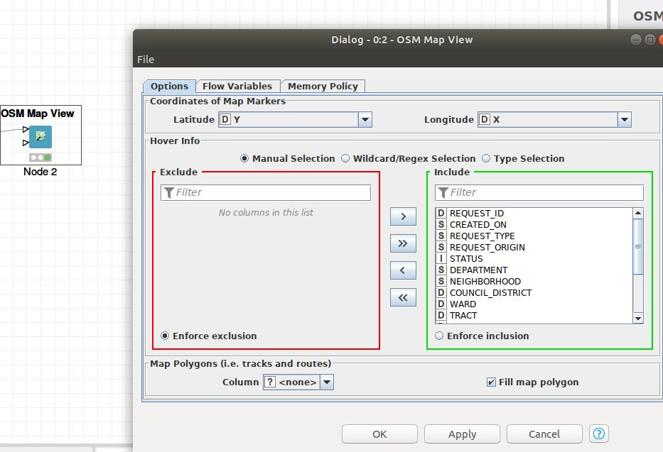
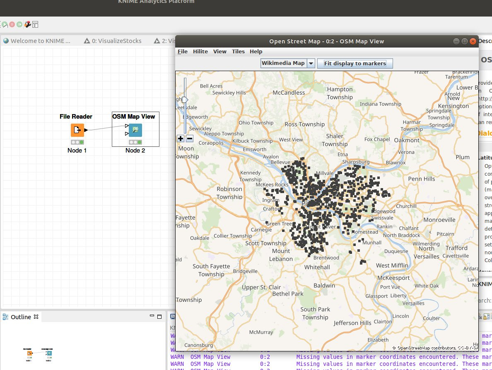

# Maps

## Maps in KNIME

Watch [this video](https://youtu.be/ZhPiiuqUxqQ)  

Install KNIME extension open street map integration.  

In case you need some background on installing [KNIME extensions](https://www.google.com/search?q=install+knime+extensions&oq=install+KNIME+extensions&aqs=chrome.0.0l5.3443j0j7&sourceid=chrome&ie=UTF-8#kpvalbx=_bwSLXoTzE4PJ1QG_s7-ICg20)  

go to file->Install KNIME Extensions  
Search for 'open street map' 

Get the test data [here](http://localhost:8888/edit/visualization_projects/pit311_small.csv) and load into KNIME.  

Set Latitude and Longitude on the OSM Map View.  
 

 Choose 'View Open Street Map' and hit 'Fit to Markers' and you should get the following map...  

 