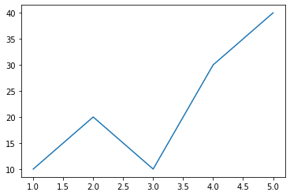
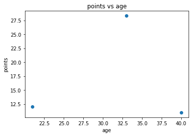

# Visualization with Python via Matplotlib 

We will learn visualization with Python a few different ways.  Each way is demonstrated using a series of notebooks. 

## Visualization with Matplotlib

Matplotlib is a plotting library for Python.  Use Matplotlib to plot Python structures such as lists and arrays.   The Matplotlib documentation can be found [here](https://matplotlib.org/) and a matplotlib gallery can be found [here](https://matplotlib.org/gallery/index.html).  

## Basic Visualization with Matplotlib

Download and work through this [notebook](https://github.com/bnorthan/inf-428-data-analytics-online/blob/master/python/notebooks/visualization/BasicPython.ipynb) to learn the basics of Matplotlib.  This example show how to do a line chart.

## Python examples 

[This notebook](https://github.com/bnorthan/inf-428-data-analytics-online/blob/master/python/notebooks/visualization/PythonExamples.ipynb) shows how to create other basic plot types.  The basic plot types are. 

### Line Charts

Line charts are useful to show trends.  Line charts show the evolution of a dependent variable on the y axis as a function of x.  For example you could show the evolution of a variable as a function of time, like the number of sales your company has made per time perid. This [notebook](https://github.com/bnorthan/inf-428-data-analytics-online/blob/master/python/notebooks/visualization/BasicPython.ipynb) shows how to create, add legends, lable and a title and add a grid to a line chart.  The basic concepts are applicable to any type of chart. 

### Bar Charts

Bar charts are useful when performing a comparison.  In the [example notebook](https://github.com/bnorthan/inf-428-data-analytics-online/blob/master/python/notebooks/visualization/PythonExamples.ipynb) there is a cell that shows how to use a bar chart to compare points scored by different basketball players.

### Scatter plots

A scatter plot shows the relationship between two variables.  
In the [example notebook](https://github.com/bnorthan/inf-428-data-analytics-online/blob/master/python/notebooks/visualization/PythonExamples.ipynb) there is a cell that shows how to use a scatter plot to show the relationship between a hypothetical dataset containing Basketball player's age and points.  In this case the number of samples is far to small to tell whether there is a relationship or not.  We will talk more about using scatter plots to detect relationships in a later section. 

### Bubble Charts 

A bubble chart shows the relationship between three variables.  

In a bubble chart the x axis represents the independent variable, the y axis represents the first dependent variable and the size of the marker (the bubble) represents the other dependent variable.  

In the [example notebook](https://github.com/bnorthan/inf-428-data-analytics-online/blob/master/python/notebooks/visualization/PythonExamples.ipynb) there is a cell that shows how to plot the relationship between a players age and both their points and assists.  

### Pie Charts

A pie chart is another way to do a composition.  

#### When to choose a Pie Chart instead of a bar chart??

A good rule of thumb is to use a pie chart if you are trying to show the share of a total.  For example if you are showing the number of points for NBA stars on different teams, a bar chart makes sense, however if you are showing the number of points scored by players on the same team, a pie chart may make more sense, because it shows the relative share of points for the team members. 

In the [example notebook](https://github.com/bnorthan/inf-428-data-analytics-online/blob/master/python/notebooks/visualization/PythonExamples.ipynb) there is a cell that shows how to plot the relationship between a players age and both their points and assists.  

<
